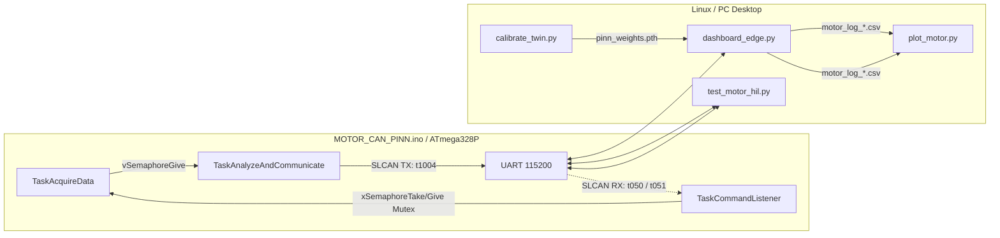

# Motor PINN IIoT — Technical Reference

End-to-end prototype: **Arduino Uno (FreeRTOS)** exposes motor-style telemetry over **SLCAN-framed UART**, a **host PC** runs calibration and an **edge-inference dashboard** (PyTorch PINN + PyQt), and **pytest** automates hardware-in-the-loop (HIL) checks. Typical bring-up: **Proteus** simulation with **COMPIM** to a **Linux** serial device, or real hardware on the same UART path.

---

## System architecture



**Important:** The firmware does **not** stream 50 raw ADC samples. Each cycle it sends **one** compact frame: temperature, RMS, PWM, status. The Python tools **reconstruct** a 50-point “wave” from RMS and a temperature-linked decay for alignment with the PINN UI (see below).

---

## Serial configuration

| Parameter | Value |
|-----------|--------|
| Baud rate | `115200` |
| Default Linux device | `/dev/ttyS0` (change to `COMx` on Windows or your Proteus/COMPIM mapping) |
| Line ending | Carriage return `\r` (SLCAN-style) |

All Python scripts use module-level `PORT` and `BAUD`; adjust before running.

---

## Operating instructions

### Prerequisites

| Component | Notes |
|-----------|--------|
| MCU | Arduino Uno (or compatible AVR) — **Arduino_FreeRTOS** library required |
| Host | Linux (tested with Proteus **COMPIM** → virtual serial) or Windows with USB–serial |
| Python | 3.x with `pip` (use a **venv** for isolation) |

Install Python dependencies (example):

```bash
python -m venv venv
source venv/bin/activate          # Linux / macOS
# venv\Scripts\activate           # Windows cmd/PowerShell

pip install pyserial torch numpy pytest PyQt5 pyqtgraph pandas matplotlib
```

On Debian/Ubuntu you can install pytest via APT (`sudo apt install python3-pytest`) if you prefer.

### Linux: serial port permissions

USB–serial adapters and some virtual ports require membership in the **`dialout`** group:

```bash
sudo usermod -a -G dialout $USER
```

Log out and back in, or run **`newgrp dialout`** in the current shell (you may need to **`source venv/bin/activate`** again afterward). Without this, opening `/dev/ttyUSB0` or similar often fails with “Permission denied”.

### Point every script at the same UART

Edit **`PORT`** (and **`BAUD`** if you changed firmware) in each file you use:

| File | Typical values |
|------|----------------|
| `calibrate_twin.py` | `PORT = '/dev/ttyS0'` or `/dev/ttyUSB0`; Windows: `COM3` |
| `dashboard_edge.py` | same |
| `test_motor_hil.py` | same |
| `pytest_hil.py` | same |
| `pinnmotor.py` | same (alternate dashboard) |

**Proteus + COMPIM:** bind COMPIM to the host port your OS exposes (e.g. a pty or `/dev/ttyS0` if mapped). **Baud must be 115200** on both sides.

### Flash the firmware

1. Install **Arduino IDE** (or use **arduino-cli**) and add the **Arduino_FreeRTOS** library (Library Manager).
2. Open **`MOTOR_CAN_PINN.ino`**, select **Arduino Uno** (or your board), compile and upload.
3. Confirm **115200 baud** on the serial monitor if you probe the link (line format: `t1004…` + `\r`).

### Normal run sequence (calibration → dashboard → optional plot)

Do this with **one** serial client at a time (close the Arduino Serial Monitor before running Python).

1. **Calibrate** (trains PINN and writes the baseline file):

   ```bash
   source venv/bin/activate
   python calibrate_twin.py
   ```

   Waits for a valid **`t1004…`** frame, then trains (can take several minutes). Produces **`motor_baseline.pt`** in the current directory.  
   *If calibration cannot see traffic:* check `PORT`, wiring/COMPIM, and that nothing else holds the port open.

2. **Edge dashboard** (live UI + CSV log):

   ```bash
   python dashboard_edge.py
   ```

   On start it loads **`motor_baseline.pt`**. If the file is missing, run **`calibrate_twin.py`** first.  
   Logs appear as **`motor_log_YYYYMMDD_HHMMSS.csv`**. Close the window to stop; the worker stops cleanly.

3. **Post-run plot** (optional):

   ```bash
   python plot_motor.py motor_log_20260327_065615.csv
   ```

   Pass your actual log path. Output: **`<name>_architectural_report.png`** and an interactive figure.

### Hardware-in-the-loop tests

Requires the **same** `PORT` as the firmware and **no other program** using that serial port.

```bash
pytest test_motor_hil.py -v -s
```

The fixture waits **~3.5 s** after opening the port (MCU reset + FreeRTOS boot). If tests fail to settle, increase timeouts only after checking baud and port.

Shorter checks:

```bash
pytest pytest_hil.py -v -s
```

### Alternate UI: `pinnmotor.py`

All-in-one dashboard with **online** PINN updates per frame and a different CSV name:

```bash
python pinnmotor.py
```

Use either **`pinnmotor.py`** **or** **`dashboard_edge.py`**, not both on the same port at once.

### Troubleshooting

| Symptom | Things to check |
|---------|------------------|
| `Permission denied` on `/dev/tty…` | `dialout` group, or run from a user-owned pty |
| No `t1004` lines | Wrong port, wrong baud, Proteus not running, COMPIM not bridged |
| Calibration hangs | Override cleared with `t0510` in code path; ensure firmware is running and transmitting |
| Dashboard: “NO BASELINE” | Run **`calibrate_twin.py`** first |
| HIL flaky under simulation | Slow Proteus: keep boot delay; avoid Serial Monitor + pytest simultaneously |
| Garbled data | Single shared ground; 115200 on MCU and COMPIM |

---

## 1. Firmware: `MOTOR_CAN_PINN.ino`

### Role

Bare-metal-oriented **AVR** firmware (Arduino Uno class) using **Arduino_FreeRTOS**: acquire a vibration buffer, compute **integer RMS**, apply **thermal / vibration safety rules**, drive **PWM**, and **emit / accept** SLCAN-like ASCII on `Serial`.

### RTOS tasks

| Task | Priority | Stack (words) | Function |
|------|----------|---------------|----------|
| `TaskCommandListener` | 3 (highest) | 150 | Parse incoming SLCAN commands; set/clear temperature **override** |
| `TaskAcquireData` | 2 | 150 | Fill `processedBuffer[50]`; update temperature from **I2C** unless overridden |
| `TaskAnalyzeAndCommunicate` | 1 | 220 | Wait for buffer; compute RMS; set status/PWM; **SLCAN TX** |

`loop()` is unused.

### Synchronization

- **`bufferReadySemaphore` (binary):** `TaskAcquireData` gives after 50 samples; `TaskAnalyzeAndCommunicate` takes (blocking). Couples one acquisition burst to one analysis/transmit cycle.
- **`systemStateMutex`:** Protects `currentTemp`, `tempOverride`, `motorPWM` across tasks.

### `TaskAcquireData`

1. Under mutex: read `tempOverride` and `currentTemp`.
2. If **not** overridden: `readTemperatureI2C()`, then update `currentTemp` under mutex.
3. Fixed-point “friction”: scale \(10{,}000 \equiv 1.0\):  
   `friction_sim = 10000 - (safeTemp * 5)` → equivalent to \(1 - 0.0005 \times T\) per step.
4. For each of **50** samples:
   - Start ADC conversion, busy-wait for completion.
   - `rawValue = ADC - 512` (AC component around mid-rail).
   - `processedBuffer[i] = (rawValue * amplitude) / 10000`.
   - `amplitude = amplitude * friction_sim / 10000`.
   - `vTaskDelay(1)` to yield.
5. `xSemaphoreGive(bufferReadySemaphore)`.
6. `vTaskDelayUntil` so the acquisition **period is ~500 ms** (`500 / portTICK_PERIOD_MS`).

### `TaskAnalyzeAndCommunicate`

1. `xSemaphoreTake(bufferReadySemaphore, portMAX_DELAY)`.
2. Read `currentTemp` under mutex.
3. RMS: `meanSquare = sum(samples²)/50`, `rms = isqrt(meanSquare)` — **integer square root**, no `float` sqrt.
4. **Threshold policy** (firmware; RMS limit 600 is documented as a demo-friendly raise):

   - `status == 2`, `PWM == 0`: `safeTemp > 85` **or** `rms >= 600` → **E-stop**
   - `status == 1`, `PWM == 128`: `safeTemp > 60` **or** `rms > 160` → **warning / throttle**
   - Else `status == 0`, `PWM == 255` → **healthy**

5. Update `motorPWM` under mutex; **`OCR2B = targetPWM`** (Timer2 PWM on typical Uno pin **D3**).
6. If E-stop or very low RMS, **force transmitted RMS to 0** for that frame.
7. **`sendSLCAN(0x100, 4, { temp, rms, pwm, status })`**.

### `TaskCommandListener`

- Reads `Serial` into `cmdBuffer[32]` until `\r` or `\n`.
- Lines starting with `t`: parse **3-digit hex CAN ID**, **one DLC digit**, then **DLC × 2 hex digits** payload.
- **`id == 0x050`, `dlc >= 1`:** `currentTemp = data[0]`, `tempOverride = true` (HIL / host injects temperature).
- **`id == 0x051`:** `tempOverride = false` (return to live I2C in acquisition task).
- `vTaskDelay(50 ms)` per outer loop iteration.

### `sendSLCAN`

Builds ASCII: `t` + zero-padded **3-digit hex ID** + **decimal DLC digit** + **payload hex** + `\r`.  
Example telemetry: ID `0x100`, DLC `4` → prefix **`t1004`**, matching all Python parsers.

### Peripherals (summary)

- **ADC:** AVR `ADMUX`/`ADCSRA`; default channel after reset (typically **A0**).
- **PWM:** Timer2 fast PWM, `OCR2B`.
- **I2C:** Bit-level TWI for temperature; `i2c_wait()` timeout avoids infinite hang; `setupI2C()` / `readTemperatureI2C()` target a specific sensor sequence (**0x90**, pointer **0xAA**, etc.) — swap if you change hardware.

---

## 2. Calibration: `calibrate_twin.py`

### Role

**Offline** training step: capture **one** valid telemetry line from the MCU, build the **same 50-point synthetic wave** the dashboard uses, train the **PINN** (SIREN network + physics loss), save **`motor_baseline.pt`**.

### Workflow

1. Open serial; send **`t0510\r`** to clear temperature override (use live / consistent state).
2. Wait for a line **`t1004...`** (hex ID `100`, DLC `4`).
3. Parse bytes: `temp` (chars 5–6 hex), `rms` (7–8), etc.
4. Set `current_friction = 1.0 - temp * 0.0005`, `expected_peak = rms * 1.414`.
5. Build `raw_data`: 50 samples `int(amp * sin(i * 0.314))` with `amp *= current_friction` each step (closed-form sine envelope; aligns with host-side twin, not a byte-for-byte copy of the MCU buffer).
6. Instantiate **`PINN_Engine`**: SIREN layers + `raw_c` / `raw_k` mapped through sigmoid to physical \(c, k\).
7. **Loss:** `l_data = 100 * MSE(network(t), x_data)` with `x_data = raw_data / expected_peak`; plus **`loss()`** = mean squared **damped oscillator residual**  
   \(x'' + c x' + k \cdot 50\, x\) over `t ∈ [-1,1]`.
8. **Adam** with gradient clipping; **10000** epochs (progress every 100).
9. **`torch.save({ 'model_state', 'baseline_c' }, BASELINE_FILE)`** — note: no optimizer state in this file (dashboard loads weights only).

### Artifact

- **`motor_baseline.pt`**: PyTorch state dict + scalar **`baseline_c`** (friction-like baseline used for labels).

---

## 3. Edge dashboard: `dashboard_edge.py`

### Role

**Inference-only** GUI: load `motor_baseline.pt`, read telemetry in a **QThread**, compute **health** from PINN vs reconstructed wave, optional **EMA** smoothing, log CSV, plot live vs “golden” curves.

### PINN usage

- Global **`ai_brain`**: same architecture as calibration; **no optimizer** at runtime.
- **`run_pinn_diagnostics(live_rms, live_wave)`:**
  - `t_data = linspace(-1, 1, 50)`.
  - `expected_peak = live_rms * 1.414`.
  - `golden_curve = ai_brain(t_data) * expected_peak` (numpy, `no_grad`).
  - MAE over 50 points → `normalized_error = raw_mae / max(expected_peak, 1.0)`.
  - `health_score = max(0, 100 - normalized_error * 300)`.

### `SerialWorker` (background thread)

- Creates **`motor_log_<timestamp>.csv`** with header:  
  `Time_Elapsed`, `Temperature`, `RMS_Current`, `PWM`, `Live_Damping`, `Health_Score`, `Status`.
- Parses `t1004...` lines like the calibration script.
- Rebuilds **`live_wave`** (sine × decay with `decay = 1.0 - temp * 0.0005`).
- Calls **`run_pinn_diagnostics`**, updates **EMA**:  
  `smoothed_health = alpha * raw + (1-alpha) * smoothed_health` with `alpha = 0.15`.
- If **`st_code == 2`** (critical), **forces health to 0**.
- Emits dict to UI: `Data`, `FittedCurve`, `TrueHealth`, `LiveDamping`, etc.

### UI

- PyQt5 + pyqtgraph: metrics, reload baseline button, dual curves (**Live** vs **Golden**).
- **`load_baseline()`:** `torch.load(BASELINE_FILE)`, `load_state_dict`, `ai_brain.eval()`.
- **`closeEvent`:** `worker.stop()`, `worker.wait()` for clean shutdown.

**Run:** `python dashboard_edge.py` (after `calibrate_twin.py` produced `motor_baseline.pt`).

---

## 4. HIL tests: `test_motor_hil.py`

### Role

**pytest** suite against **real or simulated** firmware on the serial port. Validates **thermal policy** and **recovery** under serial stress.

### Fixture `hardware`

- Opens `PORT`, **sleeps 3.5 s** after open (serial reset / FreeRTOS boot).
- Teardown: sends **`t0510\r`**, closes port.

### Helpers

- **`send_can_override(ser, temp_val)`:**  
  - `None` → `t0510\r` (clear override).  
  - Else → **`t0501<XX>\r`** where `XX` is hex temperature (SLCAN ID **0x050**, DLC **1**).
- **`verify_sustained_state(ser, exp_temp, exp_pwm, exp_status, duration_sec)`:**  
  - **Settling:** up to 5 s until a `t1004` frame shows `temp == exp_temp`.  
  - **Monitor:** for `duration_sec`, assert each parsed frame keeps **temp**, **PWM**, **status** stable; require **≥ 4** frames in the monitor window.

### Tests

| Test | Injected temp | Expected PWM | Expected status |
|------|----------------|--------------|-----------------|
| `test_1_baseline_stability` | 25 °C | 255 | 0 |
| `test_2_thermal_throttling` | 75 °C | 128 | 1 |
| `test_3_critical_thermal_estop` | 105 °C | 0 | 2 |
| `test_4_can_flood_and_recovery` | Flood with alternating commands, then 25 °C | 255 | 0 |

Test 4 spams **`t050119`** (25 °C) and **`t050164`** (100 °C), waits, **flushes RX**, then **`send_can_override(25)`** and verifies stable healthy state — exercises **UART buffering** and RTOS command handling.

**Run:** `pytest test_motor_hil.py -v -s` (requires device on `PORT`).

---

## 5. Post-run analytics: `plot_motor.py`

### Role

Offline **three-panel** report from a **`motor_log_*.csv`** produced by **`dashboard_edge.py`** (not the alternate logger in `pinnmotor.py`).

### Input

- Default file: CLI arg or fallback `motor_log_20260327_065615.csv`.

### Expected columns

`Time_Elapsed`, `Temperature`, `PWM`, `Live_Damping`, `RMS_Current`, `Health_Score`, `Status`

### Output

1. **Hardware:** temperature vs time; reference lines at 75 °C / 90 °C; PWM step plot on twin axis.
2. **Physics:** `Live_Damping` vs time; baseline damping at 25 °C; RMS on twin axis.
3. **Inference:** health score; background spans colored by **Status** (Healthy / Warning / CRITICAL).

Saves **`<log_basename>_architectural_report.png`** (300 DPI) and calls `plt.show()`.

**Run:** `python plot_motor.py [path/to/motor_log_....csv]`

---

## Dependencies (informal)

**Firmware:** Arduino board support, **Arduino_FreeRTOS**.

**Python (typical):** `pyserial`, `torch`, `numpy`, `pytest`, `PyQt5`, `pyqtgraph`, `pandas`, `matplotlib`.

Pin versions in `requirements.txt` for reproducibility (not bundled in this repo).

---

## Related files (not detailed above)

- **`pinnmotor.py`** — Alternate all-in-one app: **online** PINN training per frame, different CSV name, save/load baseline from UI.
- **`pytest_hil.py`** — Shorter pytest scenarios (e.g. 70 °C / 95 °C checks).
- **`instructions.md`** — Legacy quick notes (superseded by **Operating instructions** in this README).

---

## License

See `LICENSE` in the repository root.
